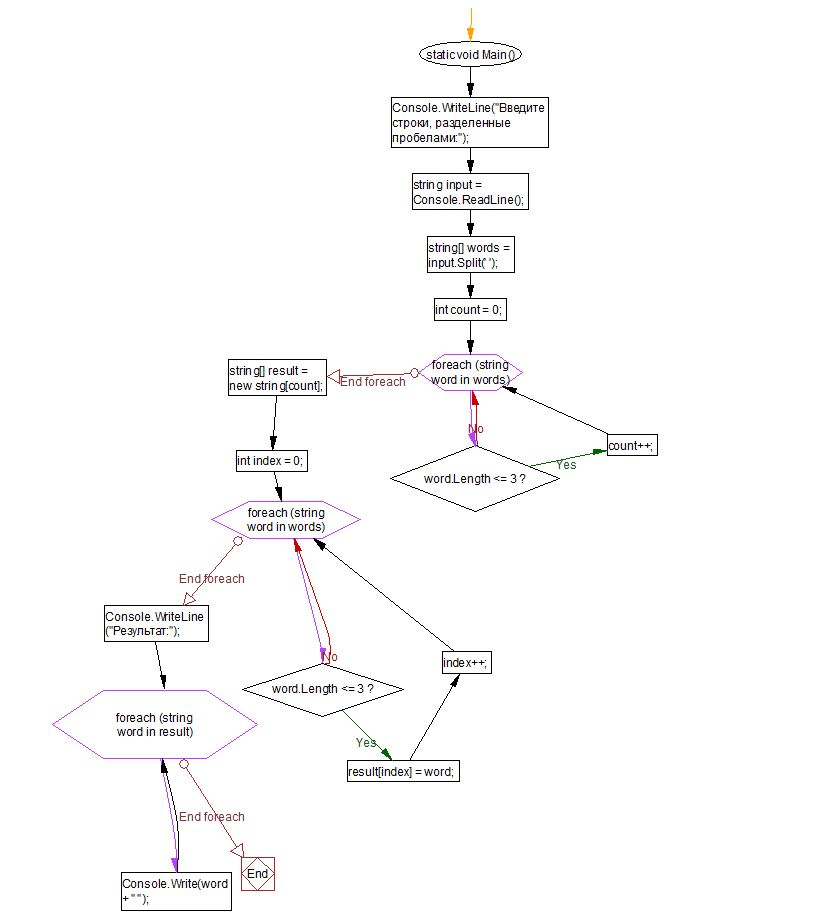

# Проверочная работа по программе "Разработчик"

## Задача

Данная работа предназначена для оценки ваших знаний и навыков после завершения первого блока обучения на программе "Разработчик". Цель - убедиться, что вы успешно освоили базовые понятия в IT.

### Шаги выполнения

1. **Создание репозитория на GitHub**: [Ссылка на репозиторий](https://gb.ru/lessons/383191/homework)

2. **Нарисовать блок-схему алгоритма**: Вам необходимо предоставить блок-схему, отражающую основную часть алгоритма. Если считаете нужным, выделите эту часть в отдельный метод.

3. **Оформление текстового описания решения**: Предоставьте подробное описание решения в файле README.md в вашем репозитории.

4. **Написание программы**: Разработайте программу, решающую поставленную задачу.

5. **Использование контроля версий**: Убедитесь, что ваш проект использует контроль версий. Каждый этап (создание репозитория, блок-схема, текстовое описание, написание программы) должен быть зафиксирован в отдельном коммите.

### Примечание

Необходимо выполнить все шаги для полноценного выполнения проверочной работы. Убедитесь, что репозиторий аккуратно оформлен, а блок-схема и текстовое описание делают ваше решение понятным для других.

### Задача:

#### Написать программу, которая из имеющегося массива строк формирует новый массив из строк, длина которых меньше, либо равна 3 символам. Первоначальный массив можно ввести с клавиатуры, либо задать на старте выполнения алгоритма. При решении не рекомендуется пользоваться коллекциями, лучше обойтись исключительно массивами

### Примеры:

    [“Hello”, “2”, “world”, “:-)”] → [“2”, “:-)”]
    [“1234”, “1567”, “-2”, “computer science”] → [“-2”]
    [“Russia”, “Denmark”, “Kazan”] → []

1. **Создал репазиторий на Github**
2. **Прилагаю блок-схему в виде изабражения**
3. **Выполнил связь со своим удаленным репозиторием**
4. **Сохранил и закомитил следующий шаг**
5. **Создал фаил для выполнения кода на языке C#**
6. **Написание кода на языке C#**
7. **Описание работы кода C#**

## Этот код выполняет следующие действия:

1. **Ввод данных:** Программа запрашивает у пользователя ввод строк, разделенных пробелами.

2. **Разделение строки на массив:** Введенная строка разбивается на массив строк (слов) с использованием пробела в качестве разделителя.

3. **Инициализация переменных:** Создаются переменные, в том числе `count` для подсчета количества слов, удовлетворяющих условию.

4. **Первый цикл (подсчет):** Программа использует цикл `foreach`, чтобы пройтись по каждому слову в массиве и подсчитать количество слов, длина которых меньше или равна 3 символам.

5. **Инициализация массива результата:** Создается новый массив `result` с размером, равным подсчитанному количеству слов.

6. **Второй цикл (заполнение массива результата):** Программа снова проходит по каждому слову в массиве и добавляет в массив результата только те слова, которые удовлетворяют условию (длина <= 3).

7. **Вывод результата:** Наконец, программа выводит результат, представляющий собой слова, удовлетворяющие условию, через пробел.
